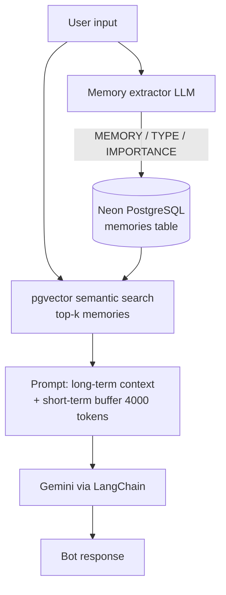

# Long-Term Memory Architecture

[](https://github.com/Dhruv8079/Long_term_memory_architecture/actions)
[](https://www.python.org)
[](LICENSE)

Gemini chatbot with **short-term token-buffer memory** + **Neon PostgreSQL + pgvector long-term memory**, with semantic recall and automatic memory extraction.

## Contents

- [Features](#features)
- [Architecture](#architecture)
- [Project structure](#project-structure)
- [Quickstart](#quickstart)
- [Configuration](#configuration)
- [Usage](#usage)
- [How long-term memory works](#how-long-term-memory-works)
- [Troubleshooting](#troubleshooting)
- [Roadmap](#roadmap)
- [Contributing](#contributing)
- [License](#license)

## Features

- Short-term memory: `ConversationTokenBufferMemory` (default 4000 tokens)
- Long-term memory: Neon PostgreSQL + pgvector, 768-dim Gemini embeddings
- Semantic search with cosine similarity + configurable threshold
- Auto-extraction of durable facts (name, skills, goals, projects, preferences)
- Per-user memory scoping via `user_id`
- Import-safe modules (`if __name__ == "__main__"`), CLI flags, typed config
- One-command DB check (`test_neon.py`) and schema (`schema.sql`)

## Architecture



Table `memories`: `id, user_id, content, memory_type, importance, embedding vector(768), created_at`.

## Project structure

```
.
├── buffer.py              # short-term only chatbot
├── long_term_memory.py    # full chatbot (short + long term)
├── config.py              # typed Settings + .env loading
├── database.py            # psycopg connection helper + init_db()
├── schema.sql             # pgvector extension + memories table
├── test_neon.py           # connectivity / extension / table check
├── buffer_memory.ipynb    # notebook demo of buffer memory
├── requirements.txt       # runtime deps
├── requirements-dev.txt   # notebook / test / lint deps
├── .env.example           # template env vars
└── .github/workflows/python-ci.yml
```

## Quickstart

**1. Create Neon DB and schema**

```sql
-- in Neon SQL editor, or: psql $DATABASE_URL -f schema.sql
CREATE EXTENSION IF NOT EXISTS vector;
CREATE TABLE IF NOT EXISTS memories (
  id SERIAL PRIMARY KEY,
  user_id TEXT NOT NULL,
  content TEXT NOT NULL,
  memory_type TEXT NOT NULL DEFAULT 'general',
  importance FLOAT NOT NULL DEFAULT 0.5,
  embedding vector(768),
  created_at TIMESTAMPTZ NOT NULL DEFAULT NOW()
);
```

**2. Configure env**

```bash
cp .env.example .env
```

```
GOOGLE_API_KEY=...
DATABASE_URL=postgresql://...?sslmode=require
```

**3. Install and verify**

```bash
pip install -r requirements.txt
python test_neon.py
```

Expected: `Connected to Neon successfully!`, `pgvector extension: enabled`, `memories table: found`.

**4. Run**

```bash
python buffer.py                          # short-term only
python long_term_memory.py --user dhruv   # full memory chatbot
```

## Configuration

| Var | Default | Description |
|-----|---------|-------------|
| `GOOGLE_API_KEY` | — | Gemini API key (required) |
| `DATABASE_URL` | — | Neon PostgreSQL URL (required for long-term) |
| `USER_ID` | `dhruv` | Memory namespace |
| `GEMINI_MODEL` | `gemini-2.0-flash` | Chat model |
| `EMBEDDING_MODEL` | `models/gemini-embedding-001` | Embedding model |
| `EMBEDDING_DIMS` | `768` | Must match `vector(N)` in schema |
| `MAX_TOKENS` | `4000` | Short-term buffer size |
| `TOP_K` | `5` | Memories retrieved per turn |
| `SIMILARITY_THRESHOLD` | `0.35` | Minimum cosine similarity to use |

Override on CLI: `python buffer.py --model gemini-2.0-flash --max-tokens 4000`.

## Usage

- `test_neon.py` — exits 0 on success, 1 on failure; safe to run in CI with secrets.
- `buffer.py` — no DB needed; good for testing prompts and token budgets.
- `long_term_memory.py` — needs DB; each turn: recall top-k memories → build grounded prompt → respond → extract and store new durable facts.
- Python API:

```python
from config import load_settings
from database import get_connection
```

## How long-term memory works

1. **Save:** `embeddings.embed_query(content)` → `INSERT INTO memories ... embedding::vector`.
2. **Recall:** embed query → `ORDER BY embedding <=> query::vector LIMIT k` → cosine similarity `1 - distance` → filter by threshold.
3. **Extract:** LLM classifies user input as `MEMORY / TYPE / IMPORTANCE` or `NO_MEMORY`; only durable facts are stored.

## Troubleshooting

- `GOOGLE_API_KEY not found` → `.env` is loaded from the script's folder; ensure `.env` sits next to `*.py`, not in parent.
- `DATABASE_URL is missing` → copy `.env.example` to `.env`.
- `pgvector extension not enabled` → run `schema.sql`.
- `memories table not found` → run `schema.sql`.
- Dimension mismatch (`vector(768)` vs model) → keep `EMBEDDING_DIMS=768` with `models/gemini-embedding-001`, or alter table.
- Old model name `gemini-3.6-flash` → override with `GEMINI_MODEL=gemini-2.0-flash`.

## Roadmap

- [ ] HNSW index for scale
- [ ] Memory decay / importance re-weighting
- [ ] Multi-user CLI + REST API
- [ ] Eval script for recall precision

## Contributing

See [CONTRIBUTING.md](CONTRIBUTING.md). Never commit `.env`.

## License

[MIT](LICENSE) © 2026 Dhruv8079.
